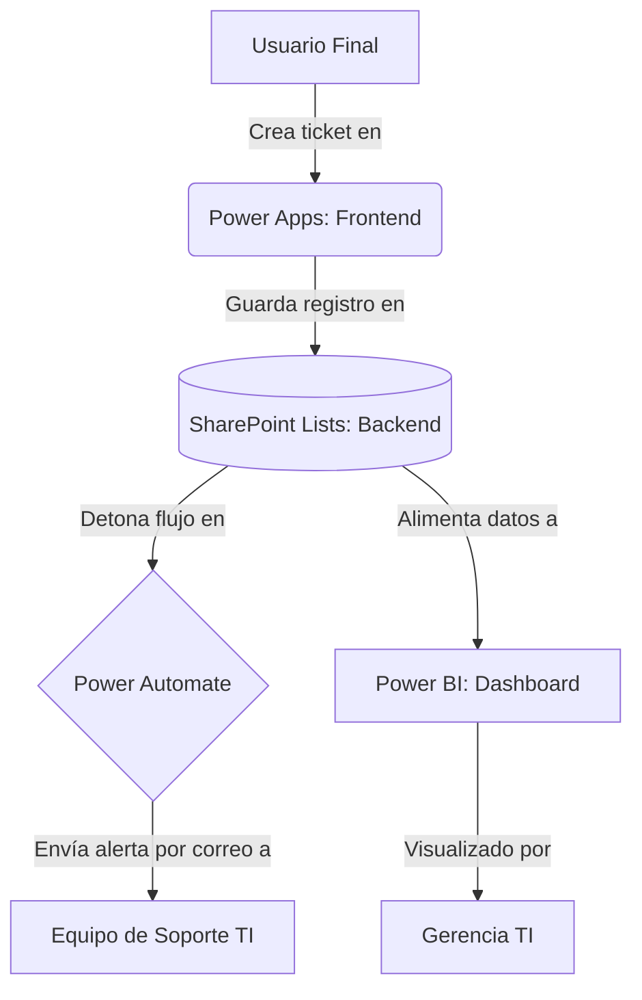
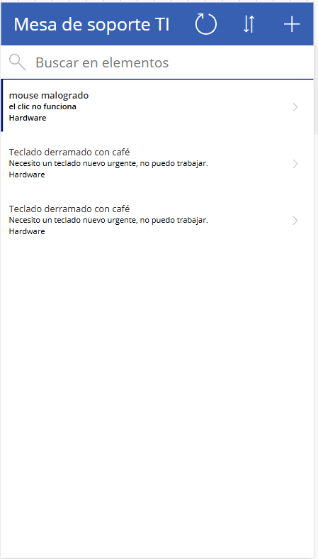
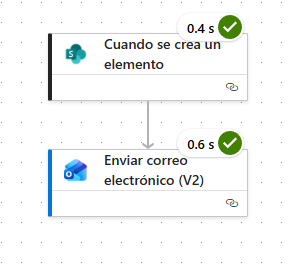
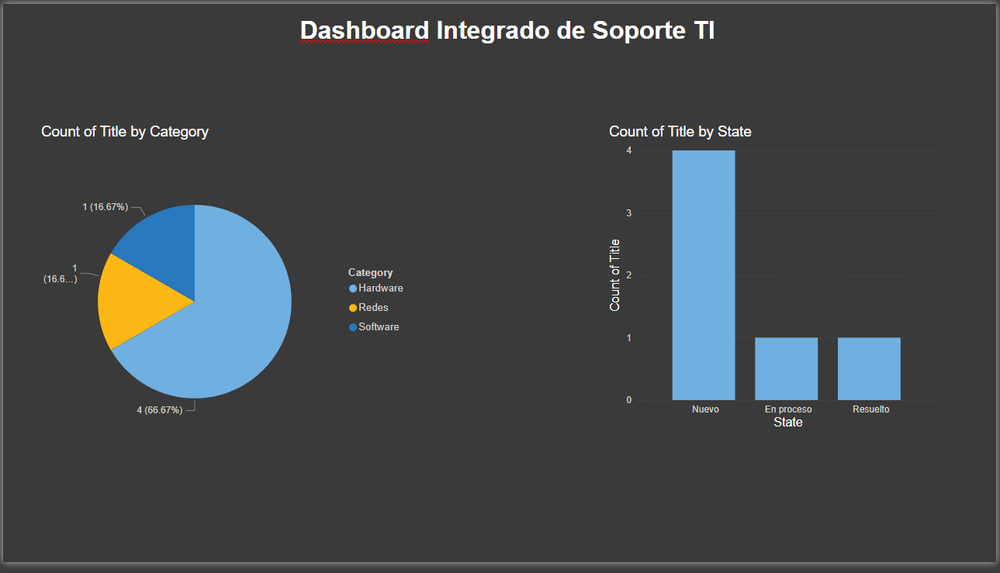

# Sistema Integrado de Soporte TI y Gestión de Activos

Este proyecto es una solución de Helpdesk "End-to-End" construida enteramente con el ecosistema Low-Code de Microsoft Power Platform. Diseñado para optimizar la recepción de reportes, notificar automáticamente a los técnicos y ofrecer métricas en tiempo real para la toma de decisiones.

## Arquitectura del Sistema

A continuación, el flujo de datos del proyecto:

## Stack Tecnológico

* Base de Datos: SharePoint Lists (Estructuración de datos y control de estados).

* Frontend: Power Apps (Canvas app adaptada a dispositivos móviles con UI/UX intuitiva).

* Backend / Automatización: Power Automate (Cloud flows para notificaciones por correo con contenido dinámico).

* Business Intelligence: Power BI (Modelado de datos y visualización interactiva con tema oscuro).

## Evidencias del Proyecto
### 1. Interfaz de Usuario (Power Apps)
Aplicación donde el usuario reporta incidencias de Hardware, Software o Redes.

### 2. Automatización en la Nube (Power Automate)
Robot que escucha la base de datos y envía correos automatizados al equipo de soporte.

### 3. Panel de Control (Power BI)
Dashboard interactivo para monitorear el volumen de tickets, categorías y estado de resolución.

## Demostración en Video
Puedes ver el sistema en funcionamiento (creación del ticket y llegada de la alerta) visualizando el siguiente video:
[Haz clic aquí para ver el video de demostración](Video.mp4)

