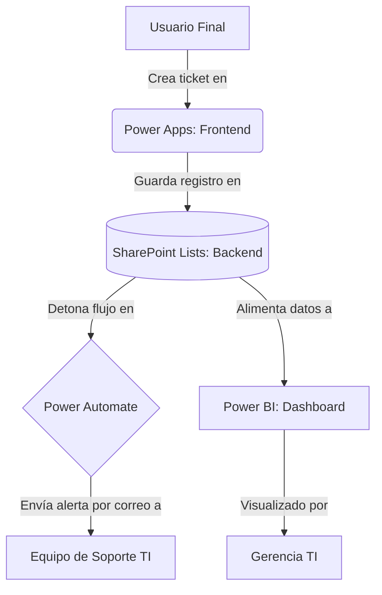

# helpdesk-powerplatform

```mermaid
graph TD
A[Usuario Final] -->|Crea ticket en| B(Power Apps: Frontend)
B -->|Guarda registro en| C[(SharePoint Lists: Backend)]
C -->|Detona flujo en| D{Power Automate}
D -->|Envía alerta por correo a| E[Equipo de Soporte TI]
C -->|Alimenta datos a| F[Power BI: Dashboard]
F -->|Visualizado por| G[Gerencia TI]
```
